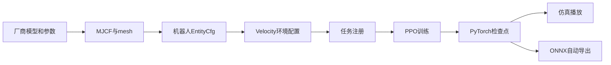
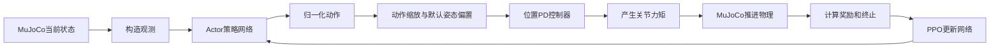
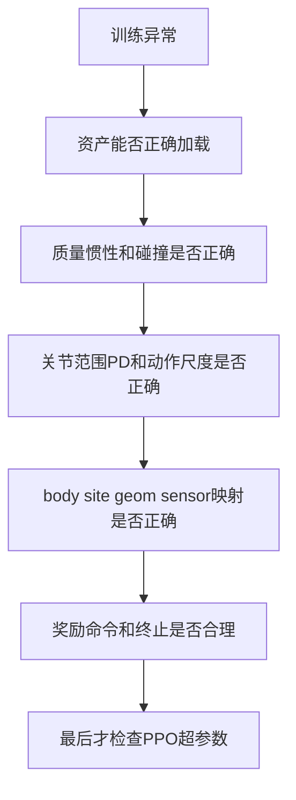

# 从零移植新机器人到 mjlab：以天工 EVT2 为完整案例

> 本文面向没有机器人机械基础、但具备基本 Python 和命令行使用经验的读者。
>
> 本文基于本仓库中 EVT2 的真实 Git 提交、最终代码和训练记录编写，不是脱离项目实际的通用概念介绍。读完后，你应该能够把一台具有 URDF 或 MJCF、mesh 和基本电机参数的新机器人接入 mjlab，完成 Velocity（速度跟踪）任务的 Flat/Rough 配置、训练、播放和 ONNX 导出。

## 目录

1. [范围与结论](#0-范围与结论)
2. [先理解整个系统](#1-先理解整个系统)
3. [MJCF 中必须认识的元素](#2-mjcf-中必须认识的元素)
4. [EVT2 真实 Git 移植时间线](#3-evt2-真实-git-移植时间线)
5. [任意新机器人移植前需要收集什么](#4-任意新机器人移植前需要收集什么)
6. [推荐的目录结构](#5-推荐的目录结构)
7. [第一步：整理和验证 MJCF](#6-第一步整理和验证-mjcf)
8. [第二步：编写机器人 constants](#7-第二步编写机器人-constants)
9. [第三步：接入 Velocity 环境](#8-第三步接入-velocity-环境)
10. [第四步：PPO 配置与任务注册](#9-第四步ppo-配置与任务注册)
11. [第五步：分阶段训练](#10-第五步分阶段训练不要直接满规模)
12. [如何阅读训练指标](#11-如何阅读训练指标)
13. [系统排错手册](#12-系统排错手册)
14. [参数调整的正确方法](#13-参数调整的正确方法)
15. [完整操作清单](#14-从新机器人到可训练任务的完整操作清单)
16. [一页式速查流程](#15-一页式速查流程)
17. [EVT2 的可复用经验](#16-evt2-案例中最值得迁移到下一台机器人的经验)
18. [最终认识](#17-最终认识)

## 0. 范围与结论

本文覆盖：

- 整理和修正 MJCF、mesh、惯性、碰撞和传感器。
- 编写机器人 `EntityCfg`、执行器、初始姿态和动作缩放。
- 接入 mjlab 的 Velocity 共享任务。
- 注册 Flat/Rough 训练与 play 配置。
- 配置 PPO、训练、排错、播放和验证 ONNX。
- 复盘 EVT2 移植中真实发生的 NaN、质量错误、脚部碰撞和关节方向问题。

本文不覆盖：

- Motion Tracking（动作模仿）。
- C++ 控制器和真机通信。
- Sim-to-Real 参数辨识和真机安全流程。

因此，“训练能导出 ONNX”不等于“策略可以直接上真机”。EVT2 当前已经打通 mjlab Velocity 仿真训练链路，但尚未实现 `deploy/robots/tienkung_evt2/`。

EVT2 最终接入链路如下：



---

## 1. 先理解整个系统

### 1.1 MuJoCo、mjlab 和 RSL-RL 分别做什么

可以把训练系统理解成三层：

1. **MuJoCo：物理世界**
   - 知道机器人每个零件的质量、形状和连接方式。
   - 根据关节力、重力、摩擦和碰撞计算下一时刻状态。
   - 不知道“走路好不好”，只负责物理计算。

2. **mjlab：训练任务**
   - 从 MuJoCo 读取关节、IMU、接触等状态，组成 observation。
   - 把策略输出变成关节目标。
   - 计算速度跟踪、姿态、脚滑等 reward。
   - 判断机器人是否摔倒并重置环境。

3. **RSL-RL：学习算法**
   - 使用 PPO 根据 observation 输出 action。
   - 根据 reward 调整神经网络。
   - 保存模型检查点。

移植新机器人时，通常不需要重写 PPO，也不应从零重写 Velocity 任务。主要工作是让新机器人的物理模型和命名正确地接到已有任务模板上。

### 1.2 一次控制循环发生了什么



本项目的位置动作大致可理解为：

```text
目标关节角 = 默认关节角 + 策略输出 × action_scale
```

策略通常输出接近 `[-1, 1]` 的数。若 `action_scale=0.25`，动作 `1.0` 表示在默认姿态基础上增加约 `0.25 rad`，即约 `14.3°`。

PD 控制器再根据目标角度产生力矩：

```text
力矩 ≈ stiffness × (目标角度 - 当前角度) - damping × 当前角速度
```

这解释了为什么 `stiffness`、`damping`、默认姿态和 `action_scale` 必须共同考虑。动作尺度过大，即使 PPO 参数完全正确，也可能让机器人瞬间撞限位、弹飞或产生 NaN。

### 1.3 最低限度的机械概念

#### Link / Body：连杆

机器人中不会变形的一块刚体，例如骨盆、大腿、小腿。URDF 常称 `link`，MJCF 主要使用 `<body>` 表达。

#### Joint：关节

连接两个 body 的运动约束。人形机器人常用 `hinge`，即只能绕一根轴旋转。关节必须有：

- 旋转轴 `axis`。
- 允许范围 `range`。
- 默认位置。
- 控制参数。

“正角度”向哪个方向转不是由关节名字决定，而由坐标系和 `axis` 决定。EVT2 的肘关节自然弯曲方向是负值，这正是本次移植中的一个真实坑。

#### Geom：几何体

MuJoCo 用 geom 处理显示或碰撞：

- visual geom：只负责看起来像机器人。
- collision geom：负责物理接触。

二者不必相同。高精度 mesh 适合显示，但未必适合碰撞。脚底通常应使用 box、capsule 等简单几何近似，避免复杂三角网格产生大量且不稳定的接触点。

#### Site：参考点

site 是没有质量的标记点，可理解为贴在机器人上的“虚拟图钉”。它可用于：

- 标记脚底位置。
- 挂载 IMU。
- 计算脚离地高度。
- 可视化调试。

EVT2 使用 `left_foot`、`right_foot` site 供脚高度和脚滑奖励使用。

#### Inertial：质量与惯性

`inertial` 不只是质量，还包括：

- 质心相对于 body 原点的位置。
- 围绕各轴旋转的难易程度，即转动惯量。

同样是 10 kg，质量集中在轴附近和分布在远处，旋转表现完全不同。不能仅保证模型外观正确而忽略惯性。

#### 摩擦

脚与地面的摩擦过小会滑，过大又可能在接触瞬间产生剧烈冲量。MuJoCo 的摩擦参数还包含扭转和滚动方向，不只是常见的滑动摩擦。

#### 刚度、阻尼、力矩上限和 armature

- `stiffness`：偏离目标角度时拉回去的强度。
- `damping`：抑制高速振荡，类似减震器。
- `effort_limit`：电机最大允许力矩。
- `armature`：反映电机转子和减速机构折算到关节侧的惯性。

精确值应优先来自厂商、控制器或已有仿真配置。EVT2 的 stiffness、damping 和 effort 来自上游 `tiangong.py`；armature 因缺少准确电机转子惯量和减速比，只能按关节尺寸分组估计，这仍是仿真精度风险。

---

## 2. MJCF 中必须认识的元素

EVT2 最终模型位于：

```text
src/assets/robots/tienkung_evt2/xmls/tiangong2dex_torq.xml
```

mesh 位于：

```text
src/assets/robots/tienkung_evt2/xmls/assets/
```

### 2.1 body 树

MJCF 的 body 是一棵树。例如腿部可抽象为：

```text
pelvis
└── hip_pitch_l_link
    └── hip_roll_l_link
        └── hip_yaw_l_link
            └── knee_pitch_l_link
                └── ankle_pitch_l_link
                    └── ankle_roll_l_link
```

父 body 运动时，全部子 body 跟着运动。任务配置中的基座、脚接触子树和自碰撞都依赖这些名字。

### 2.2 freejoint

移动机器人根 body 需要自由关节，使整个机器人能在空间中平移和旋转：

```xml
<body name="pelvis">
  <freejoint name="floating_base"/>
</body>
```

没有 freejoint，机器人会像固定在世界坐标上一样；错误地放置多个 freejoint 则会破坏模型结构。

### 2.3 joint 的 axis 与 range

例如 EVT2 的肘 pitch 范围约为：

```text
[-2.618, 0.262] rad
```

这意味着：

- 自然向前弯曲使用负值。
- 曾经试验过的 `+0.52 rad` 超出上限。
- 超范围默认姿态会被限位约束推回，产生持续大力矩。

移植时不能根据“别的机器人肘关节是正值”来猜。必须查看本机 joint range，并在 viewer 中验证实际方向。

### 2.4 visual 与 collision 分离

推荐命名约定：

```text
pelvis_visual
pelvis_collision
left_foot_front_outer_collision
```

本项目通过 `.*_collision` 正则启用碰撞。如果新模型命名不符合约定，需要修改 `CollisionCfg`，不能假设所有 geom 自动参与接触。

EVT2 最终禁用了复杂 ankle mesh 的碰撞：

```xml
contype="0" conaffinity="0"
```

并为每只脚增加 7 个 capsule。mesh 仍用于显示，capsule 负责稳定的地面接触。

### 2.5 site 与 sensor

Velocity 共享任务依赖下列 sensor 名字：

```xml
<gyro name="imu_ang_vel" site="pelvis_site"/>
<velocimeter name="imu_lin_vel" site="pelvis_site"/>
<accelerometer name="imu_acc" site="pelvis_site"/>
<subtreeangmom name="root_angmom" body="pelvis"/>
```

注意两个层次的名字：

- MJCF 中 sensor 名为 `imu_ang_vel`。
- 场景中实体名为 `robot`，任务读取时使用 `robot/imu_ang_vel`。

缺 sensor 时，Python 配置即使语法正确，也可能在环境构建或运行 observation/reward 时失败。

### 2.6 contact exclude

相邻连杆本来就通过关节连接，视觉 mesh 可能轻微重叠。若让这些相邻 body 互相碰撞，模型会持续“自己顶自己”。

MJCF 可显式排除：

```xml
<contact>
  <exclude body1="pelvis" body2="hip_pitch_l_link"/>
</contact>
```

EVT2 后续又补充了腰与头、膝与踝等非直接相邻但会因 mesh 近距离产生异常碰撞的组合。

---

## 3. EVT2 真实 Git 移植时间线

这一章不是“最终代码说明”，而是复盘真实工程过程。理解失败过程比直接复制最终文件更有价值。

### 3.1 提交总览

| 时间 | Commit | 内容 | 阶段意义 |
|---|---|---|---|
| 2026-07-17 15:52 | `48846cc` | 增加交互式机器人 XML viewer | 建立资产检查工具 |
| 2026-07-17 16:35 | `8b8ae77` | 导入 EVT2 MJCF 和 39 个 STL | 模型首次进入仓库 |
| 2026-07-17 18:00 | `474dbac` | 增加左右脚 site 和 IMU sensor | 接入任务观测与脚奖励 |
| 2026-07-17 22:16 | `9668970` | 增加根部角动量 sensor | 满足共享 reward 输入 |
| 2026-07-20 09:34 | `130f25e` | 删除 XML actuator 块 | 改由 Python 统一注入执行器 |
| 2026-07-21 11:17 | `7187578` | 增加 constants 和 EntityCfg | 建立机器人 Python 配置 |
| 2026-07-21 11:58 | `d026991` | 从 robots 包导出配置和 scale | 供任务标准导入 |
| 2026-07-23 15:23 | `5bf1afe` | 修正 pelvis 惯性和脚 capsule | 修复核心物理问题 |
| 2026-07-23 15:27 | `99588f5` | 调整姿态、碰撞和 action scale | 固化 NaN 修复方案 |
| 2026-07-23 15:50 | `dd97496` | 增加 Velocity Flat/Rough/PPO | 打通训练、play 和导出 |

当前 EVT2 运行版相对于上游 `origin/main` 的移植提交是可追踪的。另有未跟踪目录 `src/assets/robots/EVT2/`，它是原始 ROS/URDF/IsaacLab 参考包和工作底稿，不是运行时依赖。正式运行资产是小写目录 `src/assets/robots/tienkung_evt2/`。

### 3.2 `48846cc`：先让模型可见

新增 `scripts/view_robot.py`，递归列出 `src/assets/robots/**/*.xml` 并启动 MuJoCo viewer。

为什么先做 viewer：

- XML 能解析，不代表模型物理正确。
- 关节方向、初始姿态、mesh 路径和穿模只能通过可视化快速确认。
- 在启动成千上万个训练环境之前，先用单机器人定位资产问题成本最低。

通用经验：新机器人移植的第一个验收目标不是“训练能启动”，而是“单模型能稳定加载和查看”。

### 3.3 `8b8ae77`：导入模型不等于完成物理模型

提交增加：

- `tiangong2dex_torq.xml`。
- 39 个 STL，总体积约 110 MB。

初始版本已经具备完整 body/joint 树和 mesh，但存在几个后来才暴露的问题：

1. XML 自带 floor，而 mjlab scene 也创建 terrain。
2. pelvis 没有明确 inertial。
3. 脚使用复杂 ankle mesh 接触。
4. XML 内有 torque motor，而 mjlab 计划从 Python 创建 position actuator。

教训：导入模型后要按“结构、质量、碰撞、驱动、传感器”逐项审计，不能以 viewer 里长得正确作为完成标准。

### 3.4 `474dbac`：补脚 site 和 IMU

增加：

- `left_foot`。
- `right_foot`。
- `imu_ang_vel`。
- `imu_lin_vel`。
- `imu_acc`。

这些不是为了美观：

- actor 需要角速度。
- critic 需要线速度。
- `foot_clearance`、`foot_slip` 和 foot height observation 需要脚部 site。

通用方法：先阅读共享环境 `velocity_env_cfg.py` 中 observation 和 reward 的 `sensor_name`、`site_names`，再反向确认 MJCF 是否提供对应数据。

### 3.5 `9668970`：补 root angular momentum

增加：

```xml
<subtreeangmom name="root_angmom" body="pelvis"/>
```

共享 Velocity 环境包含角动量相关项。移植时不要只满足 actor observation，还要检查 reward、critic observation、event 和 termination 的所有资产依赖。

### 3.6 `130f25e`：删除 XML actuator

原模型包含一组 torque motor。mjlab 的机器人配置会通过 `BuiltinPositionActuatorCfg` 创建执行器，因此删除 XML actuator，避免：

- 同一关节重复驱动。
- action 维度或顺序混乱。
- torque 控制和位置 PD 控制语义冲突。
- stiffness、damping、effort 出现两个真源。

通用规则：选择一个执行器配置真源。本项目的惯例是 MJCF 描述机械结构，Python `EntityArticulationInfoCfg` 描述训练所用 position actuator。

### 3.7 `7187578`：建立机器人 EntityCfg

新增 `tienkung_evt2_constants.py`，包括：

- MJCF 路径和 mesh 加载。
- 14 组执行器配置。
- 初始姿态。
- 碰撞配置。
- `get_tienkung_evt2_robot_cfg()`。
- action scale。

执行器按关节类别分组，而不是为每个关节重复配置。每组通过 regex 匹配左右关节。

初版 action scale 使用：

```text
0.25 × effort_limit / stiffness
```

该公式在 G1 中有其物理和控制设计背景，但套到 EVT2 后：

- ankle pitch：`0.25 × 100 / 30 ≈ 0.833 rad`。
- ankle roll：`0.25 × 50 / 16.8 ≈ 0.744 rad`。

这相当于策略一次可以让踝关节目标偏移约 42° 到 48°，对重约 63 kg 的 EVT2 过于激进。

教训：可以复制代码结构，不能机械复制参数公式。要计算公式代入新机器人后的实际数值并检查是否合理。

### 3.8 `d026991`：建立标准导入入口

在 `src/assets/robots/__init__.py` 导出：

```python
TIENKUNG_EVT2_ACTION_SCALE
get_tienkung_evt2_robot_cfg
```

于是任务配置可以统一写：

```python
from src.assets.robots import (
  TIENKUNG_EVT2_ACTION_SCALE,
  get_tienkung_evt2_robot_cfg,
)
```

这是包接线工作。缺少这一步不会改变 MJCF，却会让机器人无法按项目惯例被任务导入。

### 3.9 训练试错：NaN 暴露物理根因

早期训练曾出现：

```text
ValueError: The observation group 'actor' returned by the environment contains NaN values
```

一次记录在约 iteration 1040 失败。NaN 只是最后症状，不代表神经网络本身有问题。排查发现多个物理风险叠加：

- pelvis 质量由复杂 mesh 推断，严重失真。
- XML floor 与 mjlab terrain 重复。
- 脚部复杂 mesh 接触产生过多或不稳定接触点。
- action scale 让踝关节权限过大。
- 初始姿态重心较高。
- 肘关节曾使用错误正方向并超过 joint limit。

曾试验过一个基于 gait phase 的 `arm_swing` reward，但没有进入最终提交。教程必须区分：

- 最终代码中存在的方案。
- 训练期间试过但放弃的方案。
- 仅根据日志推断的因果。

### 3.10 `5bf1afe`：修正质量、地面和脚接触

这是最关键的物理修复提交。

#### 删除重复 floor

地面由 mjlab scene 统一提供。两个几乎重叠的平面可能造成重复接触和巨大冲量。

#### 补 pelvis inertial

最终 pelvis 参数：

```xml
<inertial
  pos="0.000772 -0.000475 -0.060309"
  mass="10.579253"
  fullinertia="0.089056 0.072375 0.069877 -2.6e-05 -0.00093 0.000499"/>
```

提交注释记录：缺少该 inertial 时，MuJoCo 从 pelvis mesh 推断约 42 kg，使整机约 95 kg；正确整机质量约 63 kg。

这说明：

- 根部 mesh 往往体积复杂，自动推断尤其危险。
- 总质量是模型最基本的健康检查指标。
- “模型能站起来”不能证明质量正确。

#### 用 capsule 代替脚 mesh 接触

每只脚增加 7 个 capsule，关闭 ankle mesh 碰撞。简单几何：

- 接触点更可控。
- 计算更稳定。
- 更容易随机化摩擦。
- 仍可用 visual mesh 保留外观。

#### 增加 exclude

补充腰-头、膝-踝等异常自碰撞排除，降低内部接触冲量。

### 3.11 `99588f5`：固化控制和初态修复

主要变化：

1. 更深蹲的初始腿姿：
   - hip pitch：`-0.2`。
   - knee pitch：`0.5`。
   - ankle pitch：`-0.3`。
2. pelvis 高度设为 `0.97 m`，使脚 capsule 刚好接近地面。
3. 肘 pitch 最终使用 `-0.5`，符合本模型关节方向和范围。
4. 碰撞配置由 ankle mesh 匹配改为真正的 foot capsule。
5. foot 使用 `condim=3`、较柔和的 `solref=(0.02, 1.0)`。
6. 所有关节 action scale 固定为 `0.25 rad`。

这不是“为了让 reward 好看”的任意调参，而是消除物理爆炸和控制权限过大的根因。

### 3.12 `dd97496`：接入完整 Velocity 任务

增加：

```text
src/tasks/velocity/config/tienkung_evt2/
├── __init__.py
├── env_cfgs.py
└── rl_cfg.py
```

注册：

- `Tienkung-EVT2-Flat`。
- `Tienkung-EVT2-Rough`。

配置完成：

- 新机器人实体。
- pelvis、foot site、foot geom 的名称映射。
- 接触和自碰撞 sensor。
- action scale。
- 速度命令、奖励和 play override。
- PPO 参数。

ONNX 导出器并不是此提交为 EVT2 新写的。任务注册使用已有 `VelocityOnPolicyRunner`，复用其 checkpoint 保存和 ONNX 导出能力。

### 3.13 最终训练证据应如何表述

运行目录：

```text
logs/rsl_rl/tienkung_evt2_velocity/2026-07-23_15-48-20/
```

可见：

- 多个 `model_*.pt`。
- `policy.onnx`。
- 两段 play 视频，其中一段明确使用 `model_3300`。

这能证明 Flat 训练、checkpoint、play 和 ONNX 链路已通。它不能证明：

- 已完成配置中的 10001 iterations。
- Rough 已实际训练。
- 策略已达到最终最优效果。
- 策略可直接上真机。

---

## 4. 任意新机器人移植前需要收集什么

不要拿到一个 mesh 就立即写任务配置。先建立参数清单。

### 4.1 最低必要输入

- URDF 或 MJCF。
- 全部 mesh 和纹理。
- 每个 link 的质量、质心、惯量。
- 关节名称、父子关系、轴和上下限。
- 可控关节列表。
- 每个关节的 stiffness、damping、最大力矩。
- 建议默认站立姿态。
- 机器人总质量和大致身高。
- 脚底尺寸或碰撞形状。

### 4.2 强烈建议获取

- 电机型号、转子惯量和减速比。
- 实机控制频率。
- 实机 PD 增益。
- 厂商仿真配置。
- 自碰撞过滤表。
- IMU 安装位置和方向。

### 4.3 参数来源优先级

从可靠到不可靠：

1. 厂商实机参数、CAD/URDF 和控制器配置。
2. 同一机器人官方仿真工程。
3. 同一机器人其他仿真平台配置。
4. 同尺寸、同结构机器人作为参考。
5. 经验估值。

任何估值都应写注释说明来源和风险。不要把从 G1 复制来的数值描述成 EVT2 的真实参数。

---

## 5. 推荐的目录结构

假设新机器人名为 `my_robot`：

```text
src/assets/robots/my_robot/
├── my_robot_constants.py
└── xmls/
    ├── my_robot.xml
    └── assets/
        ├── pelvis.STL
        └── ...

src/tasks/velocity/config/my_robot/
├── __init__.py
├── env_cfgs.py
└── rl_cfg.py
```

还需要修改：

```text
src/assets/robots/__init__.py
```

不需要手工维护中央任务列表。`src/tasks/__init__.py` 使用 `import_packages()` 自动导入任务配置包。

命名建议：

- Python 包名使用小写下划线。
- task ID 使用清晰的人类可读名字。
- experiment name 保持唯一。
- collision geom 统一以 `_collision` 结尾。
- 左右脚 site 使用 `left_foot`、`right_foot`，可减少 task override。

---

## 6. 第一步：整理和验证 MJCF

### 6.1 如果拿到的是 URDF 或 Xacro

厂商常提供 URDF，而不是可直接训练的 MJCF。二者都描述机器人树，但语义不完全相同：

- URDF 常与 ROS、`package://` 资源路径和 Xacro 宏配合。
- MJCF 能表达 MuJoCo 的 contact、sensor、default class、actuator 和 solver 参数。
- 自动转换只生成起点，不会自动得到适合大规模 RL 的稳定模型。

若输入是 Xacro，先在对应 ROS 环境中展开为普通 URDF。典型形式为：

```bash
xacro robot.urdf.xacro > robot.urdf
```

具体命令取决于源包依赖；应确认展开后的 URDF 不再引用未定义宏或缺失 package。

EVT2 原始工作底稿提供：

```text
src/assets/robots/EVT2/script/make_mjcf_torq.py
```

它使用 `urdf2mjcf.convert_urdf_to_mjcf`，读取 URDF 的 joint limit 和 effort，并按 effort 建立 actuator metadata。这个脚本说明了转换思路，但不能原样当成任意机器人的最终转换器，因为它还做了几项 EVT2 特定或临时处理：

- 根据 effort 档位经验设置 damping 和 frictionloss，并非厂商精确值。
- 给转换结果加入 floor，而正式 mjlab 资产后来又删除该 floor。
- 生成 XML actuator，而正式训练版后来删除 actuator，改由 Python 配置注入。
- 把 `package://.../` 路径机械替换为相对路径，仍需逐个确认 mesh 位置。

推荐转换流程：

1. 保存未经修改的原始 URDF/Xacro、mesh 和参数表，作为可追溯源文件。
2. 展开 Xacro，并确认所有 mesh 路径可解析。
3. 使用可靠转换工具生成初版 MJCF。
4. 对比 URDF 与 MJCF 的 body 数、可动 joint 数、joint range、质量和 mesh。
5. 手工整理 `default` class、visual/collision、sensor、contact exclude。
6. 删除与 mjlab scene 或 Python actuator 冲突的内容。
7. 把最终运行资产复制到小写规范目录；不要让训练代码依赖庞大的原始 ROS 包。

转换后至少制作一张审计表：

| 检查项 | URDF 来源值 | MJCF 转换值 | 是否一致 |
|---|---:|---:|---|
| 可动关节数 |  |  |  |
| 总质量 |  |  |  |
| 根 link |  |  |  |
| 左右脚 link |  |  |  |
| 每个 joint 下限/上限 |  |  |  |
| 每个 joint effort |  |  |  |

如果只有 CAD mesh，没有 URDF/MJCF、关节树和惯性数据，则还不具备可靠移植条件。可以手工建模，但那已经是机器人动力学建模工作，不能靠复制本教程中的参数解决。

### 6.2 先保证 XML 独立加载

运行：

```bash
python scripts/view_robot.py
```

选择新机器人 XML。检查：

- mesh 是否全部找到。
- body 层级是否合理。
- 左右是否颠倒。
- 关节是否绕正确轴旋转。
- 初始模型是否明显穿模。
- 根 body 是否有 freejoint。

此时只验证资产，不要急着跑 PPO。

### 6.3 审核所有惯性

检查每个主要 body 是否有 inertial，尤其：

- pelvis/base。
- torso。
- 大腿和小腿。
- 脚。

验证总质量应接近数据表。若总质量差几十公斤，优先修复模型，不要通过 reward 或 PPO 参数掩盖。

常见错误：

- mesh 单位是毫米，但模型按米解释。
- inertial 缺失后由复杂 mesh 推断。
- 惯量单位换算错误。
- 质心坐标属于不同坐标系。
- 同一零件重复计入质量。

### 6.4 分离 visual 和 collision

建议：

- visual 使用原始高精度 mesh。
- torso/limb collision 使用简化 mesh、capsule 或 box。
- 脚底优先使用多个 capsule/box 近似。
- 传感器随机化需要的脚 geom 使用稳定、可预测的名字。

不要为了“看起来精确”让所有高面数 mesh 都参与碰撞。RL 会同时仿真成千上万个环境，接触稳定性和计算开销更重要。

### 6.5 处理地面

机器人资产 XML 通常不应自带训练 floor，因为 mjlab scene 会创建 Flat plane 或 Rough terrain。

检查：

```xml
<geom name="floor" type="plane" .../>
```

若存在，应确认不会与 scene terrain 重复。EVT2 最终删除了资产内 floor。

### 6.6 增加脚 site

在左右脚最终 body 下分别放置：

```xml
<site name="left_foot" pos="..." size="0.02"/>
<site name="right_foot" pos="..." size="0.02"/>
```

位置应代表脚底参考中心，而不是 ankle 关节中心。通过 viewer 显示 site，确认它接近脚底。

### 6.7 增加任务所需 sensor

至少对照共享 `velocity_env_cfg.py` 检查：

- `imu_ang_vel`。
- `imu_lin_vel`。
- `root_angmom`。

sensor 挂载 site 的方向会影响观测。不能只保证名字一致，还要确认 IMU 坐标轴与模型约定合理。

### 6.8 处理自碰撞

先排除直接相邻 body，再通过 viewer 和接触日志排查非相邻但几何重叠的组合。

不要全局关闭自碰撞来快速通过训练，因为：

- 手臂可穿过身体。
- 腿可互相穿透。
- 策略可能学习不可实现动作。

正确做法是只排除机械结构上不应计算或因模型近似导致误碰撞的组合。

### 6.9 删除或统一 actuator

若采用本项目 `BuiltinPositionActuatorCfg`，清除 MJCF 中冲突的 actuator。保留 joint 的 range、frictionloss 等机械属性，但确保驱动只有一个真源。

### 6.10 MJCF 阶段完成标准

- XML 可独立加载。
- mesh 无缺失。
- 根自由运动正常。
- 总质量合理。
- 每个关节方向和范围已人工确认。
- 默认姿态没有明显穿模。
- 左右脚接触几何和 site 正确。
- 必需 sensor 存在。
- 无重复地面。
- 无重复 actuator。

---

## 7. 第二步：编写机器人 constants

参考：

```text
src/assets/robots/tienkung_evt2/tienkung_evt2_constants.py
```

### 7.1 加载 MJCF 和 mesh

核心结构：

```python
ROBOT_XML = SRC_PATH / "assets" / "robots" / "my_robot" / "xmls" / "my_robot.xml"
assert ROBOT_XML.exists()

def get_assets(meshdir: str) -> dict[str, bytes]:
  assets: dict[str, bytes] = {}
  update_assets(assets, ROBOT_XML.parent / "assets", meshdir)
  return assets

def get_spec() -> mujoco.MjSpec:
  spec = mujoco.MjSpec.from_file(str(ROBOT_XML))
  spec.assets = get_assets(spec.meshdir)
  return spec
```

这一步把文件系统中的 MJCF 和 mesh 变成 mjlab 可创建多个环境的 `MjSpec`。

### 7.2 按硬件参数分组执行器

示例：

```python
HIP_ACTUATOR = BuiltinPositionActuatorCfg(
  target_names_expr=(".*hip_(roll|pitch).*_joint",),
  stiffness=300.0,
  damping=10.0,
  effort_limit=200.0,
  armature=0.03,
)
```

分组原则：

- 参数完全相同的关节可放一组。
- 左右对称关节通常放一组。
- 不要为了减少代码而把参数不同的电机放一组。
- regex 必须覆盖每个可控关节且只覆盖一次。

### 7.3 系统检查 regex

最危险的错误之一是 regex：

- 漏掉关节：该关节没有控制。
- 重复匹配：同一关节被多个 actuator 覆盖。
- 匹配到固定关节或不希望控制的部件。

建立关节清单：

```text
关节名 | actuator组 | stiffness | damping | effort | action scale
```

逐项核对，而不是只凭肉眼判断 `.*`。

EVT2 与 G1 命名不同：

| 部位 | G1 示例 | EVT2 示例 |
|---|---|---|
| 左髋 pitch | `left_hip_pitch_joint` | `hip_pitch_l_joint` |
| 左膝 | `left_knee_joint` | `knee_pitch_l_joint` |
| 左踝 roll | `left_ankle_roll_joint` | `ankle_roll_l_joint` |
| 左肘 | `left_elbow_joint` | `elbow_pitch_l_joint` |

复制 G1 regex 而不检查命名会静默漏匹配。

### 7.4 设置初始姿态

```python
HOME_KEYFRAME = EntityCfg.InitialStateCfg(
  pos=(0.0, 0.0, base_height),
  joint_pos={
    ".*hip_pitch.*": ...,
    ".*knee.*": ...,
    ".*ankle_pitch.*": ...,
  },
  joint_vel={".*": 0.0},
)
```

确定初始姿态的顺序：

1. 使用厂商默认站姿。
2. 确认每个角度在 joint range 内。
3. 在 viewer 检查实际弯曲方向。
4. 调整 base 高度，让脚碰撞体接近但不深插地面。
5. 用零策略检查 PD 是否能维持附近姿态。

不要用增大 stiffness 来补偿严重错误的 base 高度或关节方向。

### 7.5 配置碰撞

EVT2：

```python
FULL_COLLISION = CollisionCfg(
  geom_names_expr=(".*_collision",),
  condim={
    r".*foot.*_collision$": 3,
    ".*_collision": 1,
  },
  priority={r".*foot.*_collision$": 1},
  friction={r".*foot.*_collision$": (0.6, 0.005, 0.0001)},
  solref={r".*foot.*_collision$": (0.02, 1.0)},
)
```

理解：

- `geom_names_expr` 决定哪些 geom 加入碰撞。
- foot 使用更多接触维度处理滑动/扭转。
- friction 控制接触摩擦。
- `solref` 影响接触约束的软硬和响应。

先参考成熟机器人，再根据物理表现调整。不要在不了解含义时一次修改多个接触参数，否则无法判断哪项有效。

### 7.6 组装 EntityCfg

```python
ARTICULATION = EntityArticulationInfoCfg(
  actuators=(...),
  soft_joint_pos_limit_factor=0.9,
)

def get_my_robot_cfg() -> EntityCfg:
  return EntityCfg(
    init_state=HOME_KEYFRAME,
    collisions=(FULL_COLLISION,),
    spec_fn=get_spec,
    articulation=ARTICULATION,
  )
```

函数每次返回新配置，避免多个环境或配置修改共享可变对象。

### 7.7 选择 action scale

两种常见方式：

#### 固定尺度

```python
ACTION_SCALE[regex] = 0.25
```

优点是可解释、容易控制。EVT2 最终采用此方案，因为上游也是统一 `0.25 rad`，且公式缩放会让踝关节过大。

#### 根据 effort/stiffness 缩放

```text
scale = 0.25 × effort / stiffness
```

该方式可让相同归一化动作对应一定比例的静态控制能力，但不是通用真理。必须计算每个关节的结果：

- 是否超过关节可用范围。
- 柔软关节是否获得异常大尺度。
- 与原始控制器的动作定义是否一致。

### 7.8 增加直接 viewer 入口

constants 文件可加入：

```python
if __name__ == "__main__":
  robot = Entity(get_my_robot_cfg())
  viewer.launch(robot.spec.compile())
```

运行：

```bash
python src/assets/robots/my_robot/my_robot_constants.py
```

这比启动完整训练更适合验证执行器注入、碰撞配置和默认姿态。

### 7.9 从 robots 包导出

修改 `src/assets/robots/__init__.py`：

```python
from .my_robot.my_robot_constants import (
  MY_ROBOT_ACTION_SCALE as MY_ROBOT_ACTION_SCALE,
)
from .my_robot.my_robot_constants import (
  get_my_robot_cfg as get_my_robot_cfg,
)
```

### 7.10 constants 阶段完成标准

- `get_spec()` 编译成功。
- 每个可控 joint 被恰好一个 actuator 覆盖。
- PD/effort 参数来源有记录。
- 默认姿态不超限。
- 零动作时没有立即弹飞。
- 脚接触 geom 使用预期参数。
- action scale 的每个实际值已人工检查。
- 标准包导入成功。

---

## 8. 第三步：接入 Velocity 环境

共享模板：

```text
src/tasks/velocity/velocity_env_cfg.py
```

机器人 override：

```text
src/tasks/velocity/config/tienkung_evt2/env_cfgs.py
```

正确心态是“复用共享任务并覆盖机器人差异”，不是复制整个任务后各自演化。

### 8.1 创建基础配置

```python
def my_robot_rough_env_cfg(play: bool = False) -> ManagerBasedRlEnvCfg:
  cfg = make_velocity_env_cfg()
  cfg.scene.entities = {"robot": get_my_robot_cfg()}
```

从 Rough 开始定义，再让 Flat 继承 Rough 并移除地形相关项，可减少重复。

### 8.2 设置仿真参数

EVT2 使用：

```python
cfg.sim.mujoco.timestep = 0.0025
cfg.sim.mujoco.ccd_iterations = 500
cfg.sim.contact_sensor_maxmatch = 500
cfg.sim.nconmax = 48
```

Flat 降低部分接触预算：

```python
cfg.sim.mujoco.ccd_iterations = 50
cfg.sim.contact_sensor_maxmatch = 64
cfg.sim.nconmax = None
```

这些不是所有机器人应照抄的固定值：

- timestep 越小通常越稳定，但计算越慢。
- Rough 地形和复杂接触需要更高接触容量。
- 接触容量不足可能丢失匹配或产生异常。
- 过度提高所有预算会降低训练吞吐。

建议先使用成熟同类机器人参数，出现接触问题时再有证据地调整。

### 8.3 映射基座 body

共享 terrain scan 的 frame 必须指向新机器人的基座：

```python
sensor.frame.name = "pelvis"
cfg.viewer.body_name = "pelvis"
```

奖励中涉及基座姿态和角速度的 `body_names` 也必须改为同一正确 body。

G1 某些配置使用 `torso_link`，EVT2 使用 `pelvis`。这是不能全局替换机器人名字后就忽略的语义差异。

### 8.4 映射脚 site 和 geom

```python
site_names = ("left_foot", "right_foot")
```

用于：

- critic foot height。
- `foot_clearance`。
- `foot_slip`。

脚碰撞 geom 列表用于 friction randomization。EVT2 每只脚 7 个，共 14 个，程序化生成可减少拼写错误。

site 与 geom 不是同一东西：

- site 用于位置测量。
- geom 用于物理接触和摩擦。

### 8.5 配置接触传感器

feet-ground sensor：

- primary 匹配脚部子树。
- secondary 匹配 terrain。
- 读取 found 和 force。
- 跟踪 air time。

self-collision sensor：

- 在 robot 自身 body 子树内匹配接触。
- 为 self-collision reward 提供输入。

最常见错误是 primary subtree 选错：

- 选得太高会包含小腿或整条腿接触。
- 选得太低可能漏掉实际脚碰撞 geom。

EVT2 的 foot capsule 位于 `ankle_roll_*_link` 下，但配置以 `ankle_pitch_*_link` 为 subtree 根，可覆盖其子 body。

### 8.6 接入 action scale

```python
joint_pos_action = cfg.actions["joint_pos"]
joint_pos_action.scale = MY_ROBOT_ACTION_SCALE
```

若忘记覆盖，将使用共享默认 `0.25`。这有时恰好能运行，却不一定符合该机器人的设计，因此必须显式设置。

### 8.7 调整速度命令

EVT2 初期采用：

```python
twist_cmd.rel_standing_envs = 0.4
twist_cmd.ranges.lin_vel_x = (-0.6, 1.2)
twist_cmd.ranges.lin_vel_y = (-0.5, 0.5)
twist_cmd.ranges.ang_vel_z = (-1.57, 1.57)
```

解释：

- 40% 环境给站立命令，帮助较重且尚不稳定的机器人学习基本平衡。
- 初期速度范围较保守。
- 先学会站和慢走，再扩大范围比一开始要求高速奔跑更稳。

注意共享 command curriculum 可能分阶段覆盖部分初始范围。阅读最终合成配置，不能只看机器人 override 某一行便断言整个训练期间范围恒定。

### 8.8 理解 observation

共享 actor observation 大致包括：

- base angular velocity。
- projected gravity。
- velocity command。
- gait phase。
- joint position。
- joint velocity。
- previous action。
- Rough 环境的 height scan。

critic 额外获得更完整的状态，例如 base linear velocity、脚高度和接触信息。

这叫 asymmetric actor-critic：

- actor 使用未来部署时可获得或可估计的信息。
- critic 在训练时可使用更多仿真真值，提高学习效率。

移植时通常不改 observation 结构，只需保证 sensor、body、site 名称和维度正确。

### 8.9 理解 reward，而不是盲目调权重

Velocity 任务奖励通常分为：

1. **任务目标**
   - 线速度跟踪。
   - 角速度跟踪。

2. **稳定性**
   - 身体朝向。
   - 身体角速度。
   - 存活和终止。

3. **动作质量**
   - 关节姿态偏离。
   - action rate。
   - 关节加速度或力矩。

4. **步态质量**
   - 脚抬高。
   - 脚滑。
   - air time。
   - gait phase。

5. **安全约束**
   - 自碰撞。
   - 关节限位。

EVT2 对 pose 的各关节 std 分组设置。std 可理解为“允许偏离默认姿态的宽容度”：

- hip pitch 和 knee 较宽松，允许迈步屈伸。
- ankle roll、waist roll/pitch 较严格，保持平衡和躯干稳定。
- 手腕对平衡影响较小，可更宽松。

不要只看 reward weight，还要看 reward 函数和参数。相同权重在不同归一化、std 或单位下意义可能完全不同。

### 8.10 EVT2 的生存奖励处理

EVT2：

```python
cfg.rewards["is_terminated"].weight = -20.0
cfg.rewards["alive"] = RewardTermCfg(..., weight=1.0)
```

原因是早期较重机器人频繁摔倒，原本极大的终止惩罚可能压倒其他学习信号。调整后显式鼓励存活。

这不是所有机器人的默认最佳方案。若机器人已经能稳定站立，过强 alive reward 可能让策略偏好“站着不动”而不是跟踪速度。必须同时观察速度跟踪 reward。

### 8.11 termination

EVT2 没有新增专属 termination，继承共享配置，例如：

- timeout。
- bad orientation，倾角阈值约 70°。

“没有在 EVT2 文件中看到 termination 修改”不等于“没有终止条件”。

### 8.12 Flat 配置

Flat 从 Rough 配置派生后：

1. terrain 改为 plane。
2. terrain generator 设为 `None`。
3. 删除 terrain scan sensor。
4. 删除 actor/critic 的 height scan。
5. 删除 terrain level curriculum。

不能只把 terrain 类型改为 plane，却保留依赖 Rough terrain generator 的 sensor/curriculum。

### 8.13 play override

play 不是简单复用 train cfg。EVT2 play：

- episode 设为近似无限。
- 关闭 observation corruption。
- 删除随机 push。
- 清空 curriculum。
- Rough 地形缩小。
- Flat play 限制命令范围。

目的：

- 观察策略本身，不让训练扰动反复打断。
- viewer 不因短 episode 自动重置。
- 减少可视化场景开销。

### 8.14 env 阶段完成标准

- 新机器人实体正确替换。
- terrain scan 和 viewer 使用正确基座。
- 所有 body/site/geom 名称在 MJCF 中存在。
- contact sensor 覆盖真正脚部。
- action scale 显式设置。
- reward 中资产引用全部更新。
- Flat 删除全部 Rough-only 项。
- play 关闭训练扰动。
- 环境能构建且 observation 无 NaN。

---

## 9. 第四步：PPO 配置与任务注册

### 9.1 PPO 配置

EVT2 `rl_cfg.py`：

```text
actor/critic hidden dims: 512, 256, 128
activation: ELU
observation normalization: enabled
initial action std: 0.5
learning rate: 5e-4
entropy coefficient: 0.005
PPO clip: 0.2
epochs: 5
mini-batches: 4
gamma: 0.99
lambda: 0.95
save interval: 100
steps per env: 24
max iterations: 10001
```

零基础读者只需先理解：

- actor 输出动作。
- critic 估计未来累计 reward。
- initial std 控制初期探索幅度。
- learning rate 控制更新步幅。
- entropy 鼓励探索。
- gamma 决定多重视长期收益。

首轮移植应从成熟机器人配置开始，先修模型和映射错误。不要同时大幅修改网络、PPO、reward 和物理参数，否则无法定位问题。

### 9.2 experiment name

```python
experiment_name="my_robot_velocity"
```

决定日志目录：

```text
logs/rsl_rl/my_robot_velocity/<timestamp>/
```

每个机器人应使用独立名称，避免 checkpoint 混淆。

### 9.3 注册 Flat/Rough

`__init__.py`：

```python
register_mjlab_task(
  task_id="My-Robot-Rough",
  env_cfg=my_robot_rough_env_cfg(),
  play_env_cfg=my_robot_rough_env_cfg(play=True),
  rl_cfg=my_robot_ppo_runner_cfg(),
  runner_cls=VelocityOnPolicyRunner,
)
```

Flat 同理。

使用 `VelocityOnPolicyRunner` 后可复用已有 ONNX 导出与 deployment metadata，不必为每台机器人重写 exporter。

### 9.4 检查注册

```bash
python scripts/list_envs.py
```

完成标志：

- 两个 task ID 均出现。
- import 无异常。
- Flat/Rough 对应正确工厂。
- train 和 play 使用各自配置。

---

## 10. 第五步：分阶段训练，不要直接满规模

### 10.1 阶段 A：静态资产检查

```bash
python scripts/view_robot.py
python src/assets/robots/my_robot/my_robot_constants.py
```

目标：

- 模型可加载。
- 默认姿态合理。
- 无明显穿模和错误方向。

### 10.2 阶段 B：零策略检查

使用项目支持的零 agent 方式在 play 环境检查默认姿态。若当前脚本参数可用：

```bash
python scripts/play.py My-Robot-Flat --agent zero
```

目标不是走路，而是确认：

- PD 在零动作附近工作。
- 机器人不会一开始弹飞。
- 脚接触合理。
- observation 不出现 NaN。

若当前版本 CLI 与上述参数不同，以 `python scripts/play.py --help` 为准。

### 10.3 阶段 C：小规模 Flat 冒烟

```bash
WANDB_MODE=disabled python scripts/train.py My-Robot-Flat \
  --env.scene.num-envs=64
```

先跑几十到几百 iteration，检查：

- environment reset 正常。
- 无 NaN。
- GPU 内存和速度合理。
- mean episode length 不持续为极小值。
- reward 不是全部恒定或零。

64 个环境通过后，可提高到 256，再到正式规模。小规模并不用于最终性能，而是快速暴露接线问题。

### 10.4 阶段 D：正式 Flat 训练

```bash
WANDB_MODE=disabled python scripts/train.py My-Robot-Flat \
  --env.scene.num-envs=4096
```

观察：

- mean reward 总体趋势。
- mean episode length。
- 速度跟踪 reward。
- termination 原因。
- foot slip/clearance/gait 指标。
- 是否周期性产生 checkpoint。

不要只看总 reward。策略可能通过 alive reward 获得较高总分，却不跟踪命令。

### 10.5 阶段 E：播放 checkpoint

```bash
python scripts/play.py My-Robot-Flat \
  --checkpoint_file logs/rsl_rl/my_robot_velocity/<timestamp>/model_XXXX.pt
```

视觉检查：

- 是否按前后、横向和转向命令响应。
- 是否拖脚。
- 是否脚底穿地。
- 是否靠高频抖动获得平衡。
- 手臂和腰是否异常摆动。
- 是否只会站立而不会走。

### 10.6 阶段 F：Rough

Flat 稳定后再训练 Rough：

```bash
WANDB_MODE=disabled python scripts/train.py My-Robot-Rough \
  --env.scene.num-envs=4096
```

Rough 增加地形扫描、接触复杂度和课程学习。Flat 未稳定前直接 Rough 会把物理模型问题和地形难度混在一起。

### 10.7 检查 ONNX

日志目录中应有：

```text
policy.onnx
```

并可能有外部数据文件。检查：

- 文件随 checkpoint 保存产生。
- metadata 包含关节名、stiffness、damping、action scale 等部署信息。
- play 使用 PyTorch checkpoint 的行为合理。

ONNX 存在只说明导出链路成功，不证明 C++ 部署端已正确实现 observation、关节顺序和控制频率。

---

## 11. 如何阅读训练指标

### 11.1 Mean reward

只能作为总体趋势。不同 reward 权重下的绝对值不可直接跨机器人比较。

健康迹象：

- 从低值逐步上升。
- 中途有波动但长期趋势改善。

危险迹象：

- 突然变为 NaN。
- 快速升高但速度跟踪仍接近零。
- 极早饱和且行为只是站立。

### 11.2 Mean episode length

若 episode 最大长度是 1000 steps：

- 接近 1000 表示多数环境不因摔倒提前终止。
- 长期只有十几或几十，通常表示初态、控制或碰撞严重有问题。

但“活得久”不等于“走得好”，要配合 tracking reward。

### 11.3 速度跟踪

分别看：

- linear velocity。
- angular velocity。

测试多个命令方向。只会前进不代表横移和转向已学会。

### 11.4 脚部指标

- foot clearance 低：可能拖脚、site 位置错或抬脚不足。
- foot slip 差：摩擦、接触几何或步态有问题。
- gait reward 低：相位和左右脚协调不足。

任何脚部 reward 异常恒为零时，先查 site/contact sensor 映射，不要先调权重。

### 11.5 termination

若频繁 bad orientation：

- 初始重心/姿态不稳。
- action scale 过大。
- 速度命令过难。
- PD 不适合。
- 脚接触不稳。

若没有任何 termination，但视频明显穿模，可能是终止配置没有覆盖问题，而不是训练健康。

---

## 12. 系统排错手册

排错原则：从最底层向上查。



### 12.1 XML 或 mesh 加载失败

检查：

1. XML 相对路径。
2. `meshdir`。
3. 文件名大小写。
4. STL 是否完整。
5. XML 是否引用了未复制资源。

不要在任务层处理资产路径错误。

### 12.2 找不到 body/site/geom

症状：

- environment 构建时报 KeyError。
- sensor 或 reward 初始化失败。

检查：

```bash
rg 'name="目标名字"' src/assets/robots/my_robot/xmls/my_robot.xml
```

然后检查 env 中：

- `viewer.body_name`。
- raycast frame。
- reward `body_names`。
- reward `site_names`。
- event `geom_names`。
- contact pattern。

注意 regex 与精确名字的区别。

### 12.3 一启动就穿地或悬空

检查顺序：

1. foot collision geom 实际最低点。
2. base 初始高度。
3. joint 默认姿态。
4. XML 是否还有 floor。
5. scene terrain 高度。
6. visual mesh 与 collision geom 是否不一致。

不要只根据 visual 脚底判断接触位置。

### 12.4 关节一启动就锁死或打限位

检查：

- 默认角是否在 joint range 内。
- 正负方向是否正确。
- action offset 是否使用默认姿态。
- regex 是否误匹配。
- stiffness 是否过高。
- effort 是否合理。

EVT2 肘 pitch 的 `+0.52` 就是典型反例：看似普通角度，但超出本模型正向上限。

### 12.5 机器人弹飞

优先检查：

1. 重复地面。
2. 初始 collision 深度穿透。
3. 相邻 body 自碰撞。
4. 复杂 mesh 接触。
5. 质量或惯量错误。
6. timestep 过大。
7. 接触过硬。
8. PD/action scale 过激。

弹飞通常是物理模型问题，不是“PPO 没学好”。

### 12.6 observation 出现 NaN

推荐顺序：

1. 启用项目 NaN guard（若 CLI 支持）：

   ```bash
   python scripts/train.py My-Robot-Flat \
     --env.scene.num-envs=64 \
     --enable-nan-guard
   ```

2. 确认第一个出现 NaN 的 observation term。
3. 回溯该 term 的物理量来源。
4. 检查 NaN 前一刻是否有巨大速度、接触力或关节超限。
5. 用单环境或少环境复现。
6. 暂时降低 action scale 和命令范围，判断是否由控制触发。
7. 检查质量、碰撞和 timestep。

不要简单用 `nan_to_num` 吞掉 NaN。那会隐藏物理爆炸，让策略在错误数据上训练。

EVT2 的修复路径说明：actor observation NaN 最终通过修复 pelvis 惯性、重复地面、脚碰撞、初态和 action scale 得到改善，而不是修改神经网络。

### 12.7 能站住但学不会走

检查：

- 非站立命令比例是否足够。
- tracking reward 是否正确读取 command 和速度。
- action scale 是否太小或太大。
- pose reward 是否把腿限制得太死。
- knee/hip std 是否允许迈步。
- phase 和 gait reward 是否有信号。
- alive reward 是否压过 tracking。

先从指标判断是“没有动作能力”还是“奖励鼓励了错误行为”。

### 12.8 频繁摔倒

按顺序尝试：

1. 重新检查模型，而不是立刻加 alive reward。
2. 降低命令范围。
3. 提高 standing env 比例。
4. 检查默认姿态和重心。
5. 检查 ankle action scale。
6. 检查 foot friction 和 geom。
7. 再调整 termination/alive 权重。

### 12.9 脚奖励始终为零

检查：

- site 名称是否存在。
- site 是否位于脚底。
- contact sensor subtree 是否覆盖 foot geom。
- secondary terrain 是否匹配。
- reward 使用 site 还是 geom。
- sensor fields 是否包含 reward 所需数据。

### 12.10 自碰撞惩罚异常大

检查：

- 是否把同一 subtree 同时作为 primary/secondary 后产生大量重复匹配。
- 相邻 body 是否需要 exclude。
- 默认姿态是否本身穿模。
- collision mesh 是否过大。
- force threshold 是否适合机器人质量。

不要直接删除 self-collision reward；先确认是不是模型假碰撞。

### 12.11 play 与 train 差异大

检查：

- checkpoint 和任务 ID 是否匹配。
- play 是否使用 `play_env_cfg`。
- observation normalization 是否随模型加载。
- train/play observation 维度是否一致。
- play 的命令范围是否不同。
- 训练中随机化是否让行为更鲁棒或更困难。

### 12.12 ONNX 已生成但不可用于部署

这是正常的边界问题。部署还需要完全一致的：

- 关节顺序。
- observation 顺序和归一化。
- 默认关节角。
- action scale。
- PD gains。
- 控制频率。
- IMU 坐标系。

本文只负责训练侧导出，不代表这些真机组件已经实现。

---

## 13. 参数调整的正确方法

### 13.1 一次只改变一个问题簇

可以一起改的“问题簇”示例：

- 脚 mesh 碰撞改为 capsules，并同步更新 foot geom 名称。
- 默认腿姿和 base 高度联合调整，使脚触地。

不建议一次同时修改：

- PPO learning rate。
- 全部 reward。
- action scale。
- timestep。
- 碰撞。

否则训练改善后无法知道原因。

### 13.2 每次实验记录

至少记录：

- Git commit。
- 完整命令。
- env 数量和随机种子。
- 参数快照。
- 首次异常 iteration。
- mean reward 和 episode length。
- 代表性 checkpoint 视频。
- 结论：保留、回退或继续验证。

日志目录中的 Git 快照很重要，它能还原“训练启动时”的代码，而不是后来提交后的代码。

### 13.3 先解决正确性，再优化性能

顺序应是：

1. 命名和维度正确。
2. 物理稳定。
3. 默认姿态可维持。
4. 能学习站立和慢走。
5. 改善步态质量。
6. 扩大速度与地形。
7. 优化训练吞吐。

不要在模型质量错误时讨论网络加深是否能提高 reward。

---

## 14. 从新机器人到可训练任务的完整操作清单

### 阶段 1：资料准备

- [ ] 获取 URDF/MJCF。
- [ ] 获取全部 mesh。
- [ ] 获取 link 质量、质心和惯量。
- [ ] 获取 joint axis/range。
- [ ] 获取 PD、effort 和电机资料。
- [ ] 获取默认站姿和总质量。
- [ ] 记录所有未知和估值参数。

### 阶段 2：MJCF

- [ ] 根 body 有且仅有一个 freejoint。
- [ ] body/joint 树符合机械结构。
- [ ] mesh 单位和方向正确。
- [ ] 主要 body 都有合理 inertial。
- [ ] 总质量与数据表一致。
- [ ] visual 和 collision 分离。
- [ ] 脚使用稳定碰撞几何。
- [ ] 左右脚 site 位于脚底。
- [ ] 有 `imu_ang_vel`。
- [ ] 有 `imu_lin_vel`。
- [ ] 有 `root_angmom`。
- [ ] 相邻或重叠 body 正确 exclude。
- [ ] 没有与 scene 重复的 floor。
- [ ] 没有与 Python 冲突的 actuator。
- [ ] viewer 中模型正常。

### 阶段 3：constants

- [ ] `get_spec()` 加载 XML 和 assets。
- [ ] 所有可控 joint 被 actuator 覆盖。
- [ ] 没有 joint 被重复覆盖。
- [ ] stiffness/damping/effort 有来源。
- [ ] armature 有来源或风险注释。
- [ ] 默认关节角在 range 内。
- [ ] base 高度与脚碰撞体匹配。
- [ ] 碰撞 regex 匹配实际 geom。
- [ ] action scale 的数值逐项检查。
- [ ] `get_*_robot_cfg()` 可编译。
- [ ] 已在 `src/assets/robots/__init__.py` 导出。

### 阶段 4：Velocity env

- [ ] `scene.entities` 使用新机器人。
- [ ] terrain scan frame 使用正确基座。
- [ ] viewer 跟随正确基座。
- [ ] foot site 名称正确。
- [ ] foot geom 列表完整。
- [ ] feet-ground contact subtree 正确。
- [ ] self-collision sensor 正常。
- [ ] action scale 已覆盖。
- [ ] COM randomization 使用正确 body。
- [ ] posture regex 覆盖新关节命名。
- [ ] body orientation/ang vel 使用正确 body。
- [ ] foot clearance/slip 使用正确 site。
- [ ] 命令范围适合首训。
- [ ] Flat 删除 terrain scan、height scan 和 terrain curriculum。
- [ ] play 关闭 corruption、push 和 curriculum。

### 阶段 5：注册和 PPO

- [ ] `rl_cfg.py` 有唯一 experiment name。
- [ ] Flat/Rough 均注册。
- [ ] train/play cfg 分别传入。
- [ ] runner 使用 `VelocityOnPolicyRunner`。
- [ ] `scripts/list_envs.py` 能看到任务。

### 阶段 6：训练验收

- [ ] constants viewer 正常。
- [ ] 零动作不立即弹飞。
- [ ] 64 env 冒烟无 NaN。
- [ ] 100+ iterations 后 reward 有合理趋势。
- [ ] episode length 改善。
- [ ] tracking reward 不恒为零。
- [ ] termination 原因合理。
- [ ] 4096 env 正式训练稳定。
- [ ] checkpoint 可 play。
- [ ] 多方向速度命令能响应。
- [ ] 无明显拖脚、穿地和高频抖动。
- [ ] `policy.onnx` 已生成。
- [ ] Rough 单独训练和验证后，才能声明 Rough 完成。

---

## 15. 一页式速查流程

```text
1. 收集 URDF/MJCF、mesh、惯性、关节限位、PD/effort、默认站姿
   ↓
2. 整理 src/assets/robots/<robot>/xmls/
   ↓
3. viewer 检查 mesh、方向、关节、穿模
   ↓
4. 修正 inertial、脚碰撞、site、sensor、exclude、floor、actuator
   ↓
5. 编写 <robot>_constants.py
   ↓
6. 核对 actuator regex、初态、碰撞、action scale
   ↓
7. 从 src/assets/robots/__init__.py 导出
   ↓
8. 复制成熟机器人 Velocity 配置，只覆盖机器人差异
   ↓
9. 更新 base/body/site/geom/contact/reward/action 映射
   ↓
10. 定义 Flat、Rough、play override、PPO 和任务注册
   ↓
11. list_envs → constants viewer → zero action
   ↓
12. Flat 64 env 冒烟，先消灭加载错误和 NaN
   ↓
13. Flat 正式训练，结合指标和视频调试
   ↓
14. Flat 稳定后训练 Rough
   ↓
15. 验证 checkpoint、play 和 ONNX
```

---

## 16. EVT2 案例中最值得迁移到下一台机器人的经验

### 可以直接复用的工程结构

- 机器人目录布局。
- `get_assets()`、`get_spec()`、`get_*_robot_cfg()` 模式。
- actuator 按 regex 分组。
- Rough 配置派生 Flat 配置。
- train/play 双配置。
- `register_mjlab_task`。
- `VelocityOnPolicyRunner` 自动导出 ONNX。
- 分阶段 viewer、冒烟、正式训练和 play 的流程。

### 必须针对每台机器人重新确定

- body/joint/site/geom 名字。
- joint axis 和正负方向。
- joint range。
- 质量、质心和惯量。
- 脚底碰撞形状。
- PD、effort 和 armature。
- 初始姿态与 base 高度。
- action scale。
- 接触 subtree。
- pose std。
- 首训速度范围和 standing 比例。
- timestep 和接触预算。

### 不应从 EVT2 盲目照抄

- `0.25 rad` action scale。
- `0.0025 s` timestep。
- `rel_standing_envs=0.4`。
- alive `+1`。
- termination `-20`。
- pelvis 名称。
- 14 个脚 capsule 的尺寸和位置。
- EVT2 的 actuator 数值。

这些都是 EVT2 的具体选择，不是 mjlab API 要求。

---

## 17. 最终认识

机器人移植不是“把 XML 放进目录，再复制 G1 配置”。它是四个层次逐步对齐：

1. **机械对齐**：结构、质量、惯性、关节和碰撞正确。
2. **控制对齐**：PD、力矩、默认姿态和动作尺度正确。
3. **任务对齐**：观测、site、contact、reward 和命令映射正确。
4. **训练对齐**：PPO 能在稳定物理上逐步学习，并通过指标和视频验收。

EVT2 最有价值的经验不是最终 reward 数值，而是 NaN 的排查过程：神经网络观测出现 NaN，根因却来自 pelvis 惯性缺失、重复地面、脚 mesh 接触、初始姿态和动作尺度。以后移植任何新机器人时，都应坚持从资产和物理层向上排查。

只要遵循以下原则，换机器人并不是重新开发一套 RL 系统：

- 复制框架结构，不复制未经验证的物理参数。
- 先让模型正确，再让训练运行。
- 先 Flat，再 Rough。
- 先小规模冒烟，再正式训练。
- 用 Git、日志、指标和视频共同记录证据。
- 明确区分“能加载”“能训练”“训练稳定”“效果合格”和“可以部署”。

这套流程才是从 EVT2 移植中真正可复用到任意新机器人的部分。
